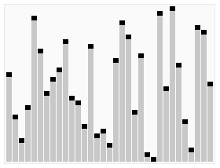

# QuickSort

 

> QuickSort의 실행 애니메이션 (출처: https://en.wikipedia.org/wiki/File:Sorting_quicksort_anim.gif)

 

QuickSort는 MergeSort와 같이 분할정복(Devide and Conquer)을 통한 정렬 방법입니다.

 

분할정복을 사용하기 때문에 평균적으로 O(NlogN)의 시간복잡도를 갖습니다만, 최악의 경우에는 O(N^2)의 시간복잡도를 갖습니다. QuickSort는 비교 기반의 정렬 중에 분할정복을 사용하기 때문에 시간복잡도 면에서 우수한 것은 당연하고, 더불어 하위 배열을 생성하지 않고 In-place로 교환을 통해 정렬한다는 점에서 공간복잡도가 O(N)으로 적다는 장점이 있습니다.

 

QuickSort의 과정은 재귀적으로 반복되는 분할정복으로 진행되며,  다음과 같습니다.

1. 만약 배열의 길이가 2 이하라면, 정렬을 종료합니다. (Escape Condition)
2. 먼저, 배열 중 Pivot을 하나 정합니다. (Conquer)

    Pivot은 일반적으로 제일 앞쪽이나 뒷쪽 끝 항목을 지정하여 사용합니다.

3. Pivot을 제외한 배열의 앞과 뒤에서부터 배열을 하나씩 확인하는데, 앞의 포인터는 Pivot보다 큰 항목을 만날 때까지 뒤로 이동합니다. 뒤의 포인터는 Pivot보다 작은 항목을 만날 때까지 앞으로 이동합니다.
4. 두 포인터의 위치가 동일하거나 역전되지 않았다면, 앞과 뒤 포인터의 항목을 교환합니다.
5. 두 포인터가 만날 때까지 과정 3~4을 반복합니다.
6. 두 포인터가 만날 경우 포인터의 항목과 Pivot을 교환합니다.

    Pivot이 앞쪽이라면 앞쪽 포인터와 교환하고, Pivot이 뒷쪽이라면 뒷쪽 포인터와 교환합니다. 이렇게 해야 Pivot 앞으로 Pivot보다 작은 항목들이 모이게 되고, Pivot 뒤로 Pivot보다 큰 항목들이 모이게 됩니다.

7. Pivot을 기준으로 앞쪽과 뒤쪽의 배열에 대해 각각 과정 1~6을 반복합니다. (Devide)
8. 정렬 완료

 

* https://gmlwjd9405.github.io/2018/05/10/algorithm-quick-sort.html

  

Fin.

