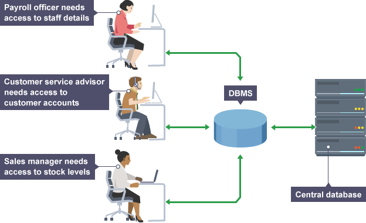

# 데이터베이스 관리 시스템(DBMS)이란 무엇이고 왜 필요한가

 

### DBMS, DataBase Management System, 데이터베이스 관리시스템

데이터베이스 관리 시스템(DBMS)는 모든 데이터를 데이터베이스에 저장하고 관리하는 전용 소프트웨어로서, 다른 응용 프로그램을 대신해 DB를 CRUD하고, 응용 프로그램은 DBMS를 통해 DB에 접근한다.

DBMS 덕분에 여러 응용 프로그램이 같은 데이터를 공유할 수 있어 ***1) 데이터의 중복 저장을 방지할 수 있고,*** DBMS가 일종의 인터페이스 역할을 하기 때문에 DB가 응용프로그램으로부터 독립되어 ***2) 데이터의 구조 변경이 자유롭고,*** 모든 데이터가 하나의 DB에 저장되어 하나의 DBMS에 의해 관리되기 때문에 ***3) 보안을 강화하기 쉽고,*** DBMS가 있는 한 ***4) 응용프로그램은 DB 걱정없이 서비스에만 집중할 수 있다.***

동시에 DBMS는 일반 파일 시스템과 달리 별도의 소프트웨어이기 때문에 ***1) 비용이 많이 들고,*** 중앙의 DBMS가 방대한 양의 DB를 관리하기 때문에 ***2) 장애가 발생했을 때 DBMS의 오류가 전체 시스템 다운으로 번질 우려가*** 있고, ***3) 장애의 정확한 원인이나 상태 파악이 어렵고, 회복 방법이 복잡하다는*** 단점이 있다.

이런 단점에도 불구하고 1960년대에 개발된 DBMS는 다양한 IT 서비스에서 필수적인 요소로 자리매김하며, 현재까지 진화를 거듭하고 있다.

 

> 
>
> DBMS 덕분에 여러 응용 프로그램에서 동시에 서로 다른 목적으로 DB에 접근하더라도 문제가 발생하지 않을 수 있다.

  

### DBMS의 주요기능

1. ***정의기능, Definition*** = DB의 테이블 구조를 정의하고, 생성하고, 수정할 수 있다.
2. ***조작기능, Manipulation*** = DB의 테이블에 데이터를 CRUD 할 수 있다.
3. ***제어기능, Control*** = 보안, 무결성 확인, 접근권한 제어 등을 제어할 수 있다.

> 이들에 대한 자세한 내용은 추후에 더 다루도록 하겠다.

  

> 출처 목록
>
> * 데이터베이스 개론 2판 / 한빛아카데미

  

Fin.
