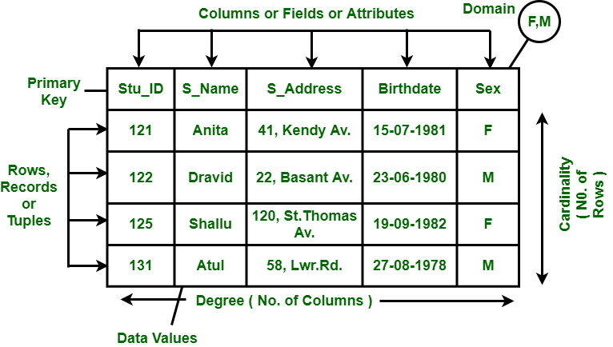

# Data Model

 

### 1960~70년대, 계층형 데이터 모델, Hierarchical Data Model

계층형 데이터 모델는 1968년 IBM에서 개발된 가장 오래된 데이터 모델이다. ***계층형 모델은 트리 형태의 데이터 모델을 사용한다.*** 루트 노트라 불리는 최상단 노드가 존재하는데, 이 노드가 하나라면 루트 노드, root node, 여러 개라면 루트 세그먼트, root segments라 불린다. 최상단 노드를 제외한 모든 노드는 부모 노드를 하나씩만 갖는 게 특징이다. 하지만 부모 노드들은 여러 개의 자식 노드를 갖는게 가능하다. 그렇기 때문에 구조적으로 ***1:N 관계의 데이터를 표현하기 유리하다.***

초창기에는 메인프레임 컴퓨터의 DBMS에 널리 쓰였지만, ***데이터 엑세스가 어렵고, M:N 같은 보다 복잡한 관계의 데이터를 저장하기에 적합하지 않으며,*** 데이터 사이에 계층이 한번 정해지면 이 구조를 변경하기 어렵다는 단점이 있다.

현재에는 XML 문서, 파일 시스템, 윈도 레지스트리 등 제한된 분야에서만 사용되고 있다.

> 
>
> 계층 DBMS는 트리와 네트워크 DBMS는 그래프와 닮았다.

  

### 1960~70년대, 네트워크형 데이터 모델, Network Data Model

네트워크형 데이터 모델은 1969년에 계층형 모델의 개선 버전으로 개발되었다. ***그래프 형태의 데이터 모델을 사용하는*** 네트워크 데이터 모델은 계층형과 달리 여러 부모 노드를 갖는 것이 가능하기 때문에 M:N 관계 같은 보다 복잡한 관계의 데이터도 저장할 수 있다. 또한 각 노드로 접근 가능한 엑세스 포인트가 늘어난 만큼 데이터 엑세스도 계층 DBMS에 비해 훨씬 빠르다.

하지만 이런 장점들에도 실제 제품들에는 거의 영향을 미치지 못해 현재에는 잘 사용되지 않는다.

> 
>
> 계층 DBMS는 트리와 네트워크 DBMS는 그래프와 닮았다.

  

### 1970~80년대, 관계형 데이터 모델, Relational Data Model

네트워크형 데이터 모델이 크게 인기를 끌지 못한 것은, 1970년 처음 개발된 관계형 데이터 모델의 영향이 크다. 앞선 두 모델과 달리 관계형 데이터 모델은 현재까지도 다양한 표준으로 채택되어 여러 서비스에 주류로 사용되고 있다.

***테이블 형태로 데이터를 저장하는*** 관계형 모델은 DB를 ***시각적으로나 논리적으로나 단순하고 이해하기 쉬운 구조로*** 구성한다는 장점이 있다. 관계형 데이터 모델의 테이블에는 고유한 키를 가지는 레코드(행)들이 존재하는데, 각 레코드는 테이블의 필드(열)들에 대한 속성값을 갖게 된다. 관계형 데이터 모델은 ***1:N, M:N 등 정형 데이터들에 대한 복잡한 데이터를 기록하는데 적합하다.***

현재 사용되는 대표적인 RDBMS는 Oracle, MS SQL Server, MS Access, MySQL, SQLite, PostgreSQL 등이 있다.

> 
>
> Django 등 웹 프레임워크들이 기본적으로 관계형 데이터 모델을 내장하기 때문에 모습이 익숙하다.

  

### 1980~90년대, 객체지향형 데이터 모델, Object-oriented Data Model

1980년대 후반에 등장한 객체지향형 데이터 모델은 사용자 정의 데이터, 오디오나 비디오 같은 멀티미디어 데이터와 같은 비정형 데이터를 관리하기 위해 등장했다. ***기존의 관계형 데이터 모델로 관리하기 어려웠던 해당 데이터들에 대한 기능을 개선시키기*** 위해 프로그래밍 영역에서 객체의 개념을 도입했다.

객체지향형 데이터 모델이 관계형에 비해 우수했던 점은 사용자 정의 타입을 지원하고, 멀티미디어, 이메일, 문서 등 비정형 데이터의 관리할 수 있다는 점, 객체 사이의 참조, reference를 이용해 접근이 쉬웠던 점, 객체지향 프로그래밍 언어들과 스키마의 구조가 유사하다는 점 등이 있었다.

다만 정형 데이터에 대해서는 관계형 데이터 모델에 비해 성능이 떨어진다는 단점이 있었다.

  

### 1980~90년대, 객체관계형 데이터 모델, Object-relational Data Model

관계형 데이터 모델에 객체지향형 데이터 모델의 장점을 통합한 객체관계형 데이터 모델은 기존의 관계형 데이터 모델이 하지 못했던 사용자 정의 타입을 지원하게 됐고, 참조, reference를 통한 테이블 간의 접근이 가능해졌으며, 일부 ORDBMS에서는 객체 간의 상속도 가능해졌다.

이런 ORDMBS가 구현된 대표적 예는 Oracle, IBM DB2, PostgreSQL 등이 있다.

현재에도 데이터 타입이 한정적인 경우에는 순수한 RDBMS가 일반적으로 사용되며, 객체지향적 특징이 필요한 경우, 다양한 데이터 포맷이 필요한 경우 등 상황에 따라 ORDBMS가 사용되고 있다. PostgreSQL이 유명해진 이유도 오픈소스이면서 이런 특징들을 포함하고 있기 때문이다.

  

### 2000년대 이후, NoSQL, Not Only SQL

이메일과 멀티미디어가 90년대에 객체지향형 데이터 모델의 등장을 이끌어냈듯, 2000년대에는 ***SNS와 빅데이터, 클라우드 컴퓨팅이*** NoSQL이라는 새로운 개념의 데이터 모델을 만들어냈다. ***Not Only SQL***이라는 뜻의 NoSQL은 RDBMS만으로는 처리하기 힘든 ***대량의 비정형 데이터를 처리하기 위해*** 고안되었다.

RDBMS의 강점인 ***안정성과 일관성 유지를 위한 복잡한 기능을 포기한*** 것이 특징이다. 데이터 구조를 정하지 않기 때문에 비정형 데이터를 처리하기 쉽고, 확장성이 뛰어나 분산 처리 환경에 사용하기 적합하다.

대표적인 NoSQL DBMS로 MongoDB, Redis, OrientDB, HBase, Cassandra, Neo4j 등이 있다.

  

### 2000년대 이후, NewSQL

NoSQL의 등장 이후에도 여전히 기업체의 DB에는 정형 데이터의 비중이 높기 때문에 RDBMS도 여전히 사용되는 추세이다. 일부는 RDBMS를 일부는 NoSQL을 사용하는 것은 비효율적이기 때문에 2011년 이를 통합하기 위해 NewSQL이 등장했다.

대표적인 예로 Spanner, VoltDB, NuoDB 등이 있다.

  

> 출처 목록
>
> * [GeeksforGeeks - Difference between Hierarchical, Network and Relational Data Model](https://www.geeksforgeeks.org/difference-between-hierarchical-network-and-relational-data-model/)
> * [pediaa - What is the Difference Between Hierarchical Network and Relational Database Model](https://pediaa.com/what-is-the-difference-between-hierarchical-network-and-relational-database-model/#:~:text=The%20main%20difference%20between%20hierarchical,the%20structure%20of%20the%20databases.)
> * [위키백과 - 계층형 모델](https://ko.wikipedia.org/wiki/%EA%B3%84%EC%B8%B5%ED%98%95_%EB%AA%A8%EB%8D%B8)
> * [위키백과 - 네트워크 모델](https://ko.wikipedia.org/wiki/%EB%84%A4%ED%8A%B8%EC%9B%8C%ED%81%AC_%EB%AA%A8%EB%8D%B8)
> * [위키백과 - 관계형 데이터베이스](https://ko.wikipedia.org/wiki/%EA%B4%80%EA%B3%84%ED%98%95_%EB%8D%B0%EC%9D%B4%ED%84%B0%EB%B2%A0%EC%9D%B4%EC%8A%A4#:~:text=%EA%B4%80%EA%B3%84%ED%98%95%20%EB%8D%B0%EC%9D%B4%ED%84%B0%EB%B2%A0%EC%9D%B4%EC%8A%A4(%E9%97%9C%E4%BF%82%E5%BD%A2%20Database,1970%EB%85%84%20%EC%97%90%EB%93%9C%EA%B1%B0%20F.))
> * [체셔's blog - DBMS의-종류관계형-객체지향형-객체관계형'](https://chessire.tistory.com/entry/DBMS%EC%9D%98-%EC%A2%85%EB%A5%98%EA%B4%80%EA%B3%84%ED%98%95-%EA%B0%9D%EC%B2%B4%EC%A7%80%ED%96%A5%ED%98%95-%EA%B0%9D%EC%B2%B4%EA%B4%80%EA%B3%84%ED%98%95)
> * [Quora - Are relational databases still more popular than object-oriented databases?](https://www.quora.com/Are-relational-databases-still-more-popular-than-object-oriented-databases)
> * 데이터베이스 개론 2판 / 한빛아카데미

  

Fin.
