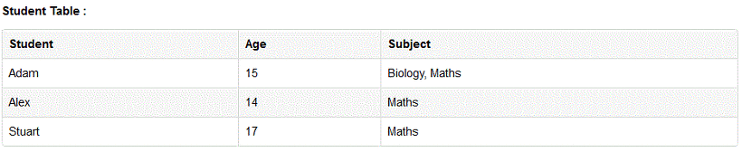
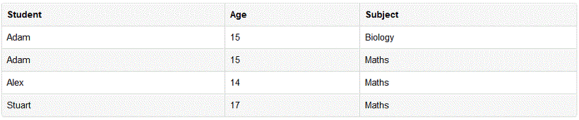

# Normalization

 

> 1차 정규화를 통해 칼럼이 원자값(Atomic Value)을 갖도록 한 예시 (위가 적용 전, 아래가 적용 후) (이미지 출처 : https://3months.tistory.com/193)

 

**DB 정규화는 일반적으로 관계형 DB를 논리적이고 무결하게 관리하기 위한 과정입니다.**
흔히 이상 문제(anomality)을 예방하기 위한 과정이기도 합니다.

 

단계별로 1NF, 2NF, 3NF, BCNF, 4NF, 5NF, 6NF 로 구분되는데,
1NF 는 레코드의 각 컬럼이 하나의 값만 가지도록 하고,
2NF 부터는 각각의 테이블의 종속관계를 밝혀 여러 테이블로 나누는 데 그 핵심이 있습니다.

 

테이블을 나누지 않는다면, 하나의 값을 CUD 하기 위해 여러 레코드를 조작해야 할 수 있습니다.
이 과정에서 비효율이 생기고, 오류가 발생할 수 있기 때문에 정규화를 통해 테이블을 분리하는 것입니다.

 

하지만 반대로 복잡한 데이터베이스에서 무리하게 정규화를 진행할 경우, 필요한 데이터를 참조하기 위해 너무 많은 JOIN이 발생해 Read 효율이 떨어질 수 있습니다. 그렇기 때문에 항상 정규화가 올바른 것은 아니며, 필요에 따라 같은 데이터를 여러 테이블에 저장하는 **반정규화(Denormalization)**를 실시해야 할 수도 있습니다.

  

> 출처 목록
>
> * [Nirsa - 이론 데이터베이스 정규화란? (이상 문제, 함수적 종속, 정규화 과정)](https://nirsa.tistory.com/107)
> * [Deep Play - 데이터베이스 정규화 1NF, 2NF, 3NF, BCNF](https://3months.tistory.com/193)

  

Fin.
