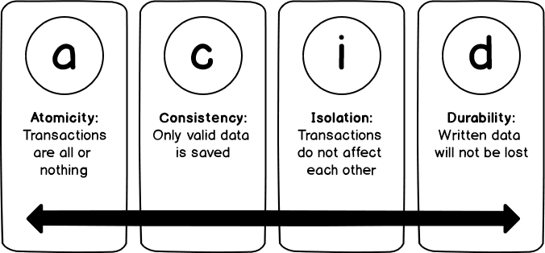

# Transaction

 

> 트랜잭션에서 중요한 ACID 개념

 

트랜잭션(Transaction)이란 DB를 조작하는 논리적으로 단일한 명령 행위를 말합니다. 대표적으로는 CRUD 명령이 있습니다.

 

트랜잭션은 ACID해야 합니다. ACID란, 원자성(Atomic), 일관성(Consistency), 독립성(Isolation), 지속성(Durability)입니다. (A) 더이상 쪼갤 수 없는 원자처럼 트랜잭션은 전체가 반영되거나 안 되어야지, 일부분만 반영되어선 안 되고, (C) 언제나 수행결과가 일정해야 하며, (I) 실행중인 트랜잭션은 외부에서 끼어들 수 없고, (D) 완료된 트랜잭션의 결과는 영구적으로 DB에 반영되어야 한다는 의미입니다.

