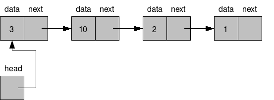

# 링크드 리스트와 배열의 차이를 설명하시오.



> 링크드 리스트의 개념 (이미지 출처 : https://freestrokes.tistory.com/84)

링크드 리스트는 전체적인 구조 없이 하나의 엔티티가 포인로서 다른 엔티티와 연결되는 형태의 자료구조입니다. 이와 달리 배열은 전체적인 길이가 존재하는 책장 같은 느낌의 자료구조입니다.

<br>

배열은 Python에서 기본 내장 데이터 타입인 반면 링크드 리스트는 그렇지 않습니다.

<br>

자료구조에 새로운 값을 추가하는 과정도 차이가 있습니다. 배열은 길이 하나의 새로운 배열을 추가하며, 이 과정은 `+`나 `.append()`로 가능합니다. 반면 링크드 리스트는 새로운 노드를 만들어 마지막 노드의 next 값에 새로 만들어진 노드를 대입하여 추가할 수 있습니다.

<br>

검색에서도 차이가 납니다. 배열은 인덱스로 특정 값에 비교적 쉽게 접근 가능하지만, 링크드 리스트는 일반적으로 맨 앞의 Head(가장 앞에 위치한 노드를 특별히 head라고 한다. 반대로 가장 뒤는 tail.) 밖에 모르기 때문에 값을 알 때까지 반복적으로 `.next`를 수행해야 합니다.

<br>

마찬가지로 값의 삭제도 배열은 지원하는 내장 함수를 사용하거나 slice를 이용해 삭제할 수 있는 반면에, 링크드 리스트는 삭제할 값을 앞선 방법으로 검색한 다음 `prev_node.next = target_node.next` 로 새로운 연결을 만드는 것으로 수행 가능합니다.

<br>

추가적으로, 각 노드에서 next 뿐 아니라 prev 의 정보도 저장할 수 있는데, 이런 링크드 리스트를 이중 링크드 리스트라고 합니다. 이중 링크드 리스트에서는 앞선 연산들이 일반 링크드 리스트보다 좀더 복잡해집니다.

<br>

```python
# 링크드 리스트의 기본적 구조
class Node:
  def __init__(self, val):
    self.val = val
    self.next = None

# 파이썬에서 배열은 내장 데이터 타입
arr = []
```

<br><br>

Fin.
