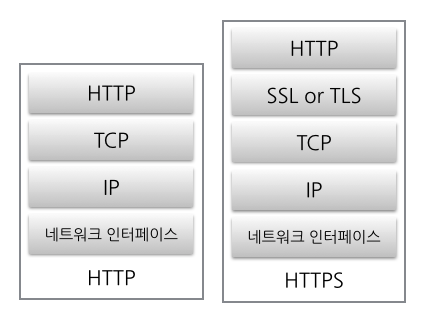

# HTTP vs HTTPS

 

> HTTPS는 HTTP 통신에 보안을 위한 SSL/TLS 계층을 추가한 프로토콜입니다. (이미지 출처 : https://wooono.tistory.com/114)

 

**HTTP와 HTTPS는 모두 네트워크 프로토콜입니다.** 이름부터 비슷한 HTTP와 HTTPS는 마지막 S에 차이점이 있는데, 이는 **Secure(보안)을 의미합니다.**

 

HTTP는 인터넷에서 사용하는 프로토콜로 클라이언트의 요청과 서버의 응답으로 구성됩니다.
여기서의 문제점은 요청 내용과 응답 내용이 서버나 클라이언트 외에 제 3자에게도 그대로 노출된다는 점입니다.

 

HTTPS는 HTTP 통신에 SSL/TLS 계층을 도입해 이런 문제점을 해결해줍니다.
**HTTPS를 통해 통신되는 모든 데이터는 암호화되고 제 3자에게 노출되어도 암호화된 정보가 보여지기 때문에 원본 데이터가 노출될 일은 없습니다.**

  

# **SSL Handshake**

 

> SSL을 통한 Handshake (이미지 출처 : https://wooono.tistory.com/114)

 

SSL은 대칭키와 비대칭키의 장점을 고루 사용해 보안성과 효율성을 보장합니다.

 

먼저, 대칭키는 암호화/복호화 과정이 비교적 빨라 효율적이지만,
대칭키를 상대방에게 전달해야 하기 때문에 이 과정에서 대칭키가 노출될 보안성이 낮습니다.

 

비대칭키는 암호화/복호화 과정이 느려 효율성이 떨어지지만,
복호화에 사용되는 비공개키는 통신 과정에서 절대 노출되지 않기 때문에 보안성이 높습니다.

 

SSL은 Handshake를 통해 최초 통신 이후로는 대칭키로 보안 통신을 하게 됩니다.

 

최초 Handshake 과정은 다음과 같습니다.

1. (클라이언트 Hello) 클라이언트가 서버에 최초 요청을 보냅니다.
2. (서버 Hello) 서버가 클라이언트에 고유한 비대칭키를 생성해 비공개키는 서버에 보관하고, 공개키를 클라이언트에 전달합니다.
3. 클라이언트가 대칭키를 만들고, 공개키로 암호화해 서버에 보냅니다.
4. 서버는 암호화된 대칭키를 복호화하여 대칭키를 확인하고, 보관합니다.
5. 서버가 대칭키로 암호화한 응답을 클라이언트에 보냅니다.

 

이후의 통신 과정은 서버, 클라이언트가 동일하게 갖고 있는 대칭키를 이용해 이루어집니다.
**결과적으로, 최초에 대칭키를 비대칭키 통신으로 안전하게 전달하고, 대칭키를 이용해 이후 통신을 효율적으로 주고 받습니다.**

  

> 출처 목록
>
> * [우노 - [보안] SSL(Secure Socket Layer) 프로토콜이란?](https://wooono.tistory.com/114)

  

Fin.
