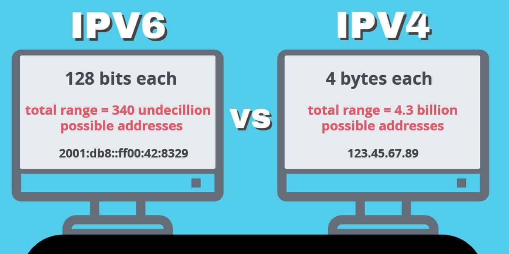

# IPv4 & IPv6

 

> IPv4와 IPv6의 데이터 용량과 가능한 표현의 조합수를 나타낸 이미지 (이미지 출처 : https://jhnyang.tistory.com/245)

 

**IPv4와 IPv6 모두 인터넷 네트워크 상에서 노드의 논리적 주소를 표기하기 위한 프로토콜입니다.** IPv4는. 192.0.0.1과 같은 4Byte 데이터로 작성되지만, IPv6는 0123:4567:89ab:cdef:0123:4567:89ab:cdef과 같은 16Byte 데이터로 작성됩니다.

 

결과적으로 **IPv6는 IPv4보다 훨씬 많은 종류의 기기를 표기할 수 있게 됩니다.** 현대에 와서 모바일이나 IoT 디바이스 등 인터넷에 접속하는 기기의 수가 많아짐에 따라 IPv6를 채용하게 된 것입니다.

  

Fin.
