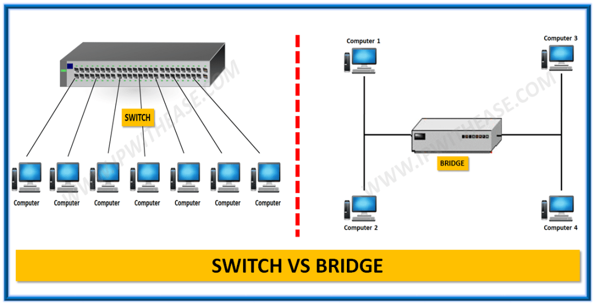

# 네트워크 접속장치들을 설명하시오

 

### 네트워크 접속 장치

네트워크 접속 장치는 네트워크를 구성하는 하드웨어 장치입니다.

  

### LAN카드 (NIC)

LAN카드는 ***PC가 전송 매체에 접속하는 최초의 인터페이스*** 입니다. NIC, Network Interface Card라고도 하며, 데이터 입출력과 송수신, 프로토콜 처리 등을 담당합니다. 네트워크에 접속하기 위한 필수적인 장비이며, 각 PC마다 고유하게 부여되는 물리적 주소인 ***MAC 주소, Media Access Control address가 바로 이 LAN 카드에 부여***되는 것입니다.

 

> 네트워크 전송 매체는 데이터가 이동하는 매체로서 크게 유선 매체와 무선 매체로 구분됩니다. 유선 매체는 케이블, 무선 매체는 전파를 뜻합니다.

> MAC 주소는 48비트이며, 앞의 24비트는 LAN카드 칩셋 제조사 고유 번호, 뒤의 24비트는 제품의 일련 번호 입니다. `ipconfig`(mac에서는 `ifconfig`)로 확인 가능하며, 16진수로 표현되는게 일반입니다. (예시, 90-2B-34-92-E0-3F)

  

### 허브, hub

허브는 필수적인 장비는 아니지만 하나의 LAN에서 세 대 이상의 장비가 서로 통신할 때 허브를 사용하면 설치가 편리하고, 가격이 저렴합니다. 형태는 입력/출력 포트가 여러개 있는 형태로 외형적으로 스위치 장비와 비슷한 경우가 많지만, 둘의 기능은 확실히 구별됩니다. 허브는 스위치와 비교해 저렴하고 원리가 단순하지만, 치명적인 단점으로 최근에는 거의 사용되고 있지 않습니다.

 

허브는 ***반이중통신방식, half duplex*** 장비입니다. 즉, 한번에 송신 혹은 수신 중 한 가지만 가능합니다. 그리고 유일한 기능은 ***하나의 포트로 들어온 데이터를 나머지 포트로 전달***하는 것 뿐입니다. 즉, 연결된 장비의 주소 구분이 없이 unintelligent한 방식으로 작동하기 때문에 허브 자체는 저렴하지만, 그로 인해 네트워크 전체의 기능 저하가 최대 단점입니다.

 

허브로 인한 네트워크의 기능 저하는 크게 세가지 이유로 일어나는데, 첫째, 모든 데이터가 모든 노드로 전달되기 때문에 각 노드들은 자신에게 필요한 데이터인지 확인하는 작업을 매번 실시해야 합니다. 둘째, 반이중방식이기 때문에 각 노드들은 대역폭을 나눠 써야 합니다. 이론적으로 할당되는 대역폭은 단순히 노드의 수로 나눈만큼이지만, 대역폭이 서로 간섭하는 것을 방지 하기 위해 대역폭 사이에 주어지는 빈 틈을 고려하면 사실은 이보다 낮은 수준입니다. 마지막으로, 접속한 노드의 수가 많을수록 그리고 각 노드에서 통신이 빈번하게 일어날 수록 대역폭 충돌, collision이 발생할 수 있습니다. 이 경우에 충돌된 데이터는 소멸되고 통신이 재개될 때까지 모든 노드는 잠시간 통신이 불가해집니다.

  

### 허브 vs 스위치?

네트워크 개론에 나오는 "더미 허브"와 "스위칭 허브"라는 용어가 있습니다. 구글링을 해본 결과, 영문 명칭임에도 불구하고 Dummy Hub는 영어권에서 사용하는 명칭은 아닌 것으로 보입니다. (한글로 "더미 허브"를 검색하면 검색결과가 나오는 걸로 보아 한국에서만? 사용하는 명칭일 수 있습니다.) 제가 아는 IT 관련 표준위원회인 IEEE가 미국에 있는 관계로, 이 글에서는 영어권 검색결과에 따라 "더미 허브"와 "스위칭 허브"의 내용은 생략하고 "허브"와 "스위치"로만 구분하겠습니다. 검색한 결과, 허브와 스위치는 엄연히 다른 장비이며 가장 큰 차이는 장비에 연결된 노드들을 구분하는 포워딩, forwarding 능력의 유무입니다. (즉, 책에서 다루는 스위칭 허브 = 스위치 가 성립합니다.)

 

> /네트워크/[네트워크] 네트워크 접속장치들을 설명하시오.assets/image-20210416010509975.png)
>
> 구글 검색 결과 dummy hub에 해당하는 내용은 나오지 않고, 위키피디아에서는 network hub를 hub의 한 종류가 아니라 밑에서 다룰 스위치의 다른 명칭이라고 밝히고 있음 (이미지 출처 1 : https://google.com/, 이미지 출처 2 : https://en.wikipedia.org/wiki/Network_switch)

  

### 스위치, Switch

스위치는 허브처럼 하나의 LAN에서 여러 장비를 연결시킬 때 사용합니다. 허브와 달리 ***전이중통신방식, full duplex***를 채택하고, ***노드의 MAC 주소를 기반으로 송신지와 수신지를 구분***하기 때문에 허브의 모든 단점이 극복된 장비입니다. 자신과 상관없는 데이터는 노드로 전달되지 않고, 여러 노드가 접속해도 대역폭이 전체 대역폭으로 고정됩니다. 또한 full duplex이기 때문에 네트워크 충돌도 발생하지 않습니다.

 

스위치는 여러 기능을 지원하는데 관리자가 기입하지 않아도 접속된 노드의 MAC 주소를 MAC 테이블에 기록하고 (=learning), 수신한 데이터를 알맞는 노드에 전달하며 (=forwarding), 수신지가 불분명할 경우 송신한 포트를 제외한 모든 포트에 전달하기도 하고 (=flooding), 데이터 수신 시 수신 포트 외의 포트를 막아 데이터 유실을 막고 (=filtering), 일정 기간 사용하지 않은 MAC 주소를 삭제하기도 합니다. (=aging)

  

### 브리지, Bridge

브리지는 두개의 LAN을 연결하는 장비로, 스위치처럼 MAC 주소를 기반으로 데이터를 전달해줍니다. 차이가 있다면, 포트수에서 물리적인 차이가 있고, 사용 측면에서 브리지는 주로 LAN의 전체 트래픽을 최소화하면서 네트워크 거리 기능을 확장하는 데 사용한다고 합니다. (정확히 이해는 가지 않음)

 

> 
>
> 스위치와 브릿지는 비슷하지만, 포트 수에서도 차이를 보입니다. 스위치는 여러개고 브릿지는 단 두 개. (이미지 출처 : https://ipwithease.com/difference-between-a-switch-and-a-bridge/)

  

### 게이트웨이, Gateway

게이트웨이는 ***종류가 다른 네트워크들을 연결***해주는 장비로서, 다른 네트워크로 전달되는 데이터 패킷이 마주하는 네트워크의 입구 같은 역할을 합니다. 연결된 네트워크끼리 통신을 지원하기 위한 ***프로토콜 변환***을 지원하며, 이로 인해 트래픽이 증가해 속도가 느려질 수 있습니다.

  

### 중계기, Repeater

모든 전송 매체는 전송 거리에 따라 신호가 약해지는 감쇠현상이 필연적입니다. 흔히 사용하는 UTP 케이블은 100m, 광섬유 케이블은 수~수백km로 전송 거리에 제한이 정해져 있습니다. 이 같은 감쇠현상을 극복하고 멀리 있는 네트워크 간에도 통신이 가능하도록 하는 장비가 중계기입니다. 중계기는 다른 역할 없이 데이터를 수신하고, ***수신한 데이터를 증폭해 다음으로 재송신***하는 역할을 수행합니다.

  

### 라우터, Router

라우터는 ***기술적으로 네트워크를 구분짓는 장비***입니다. 이는 라우터에 접속된 네트워크들이 각자 고유한 브로드캐스팅 도메인을 갖고, 라우터가 이를 인식해 데이터를 전달하기 때문입니다. 라우터에는 ***두개 이상의 네트워크들이 연결***되어 있는데, IP 주소, Internet Protocol address를 통해 네트워크에 접속한 노드들을 구분합니다.

 

라우터는 스위치와 마찬가지로 목적지에 대한 정보를 구분하기 때문에 올바른 수신지로의 데이터 전달이 가능한데, 스위치보다 상위에 위치한 장비이기 때문에 전달의 의미인 forwarding이 아니라, ***수신지로의 경로를 찾아주는 routing***을 통해 데이터를 전달합니다. 또한 스위치의 MAC 테이블 처럼 IP 주소가 포함된 라우팅 테이블로 작동하는데, 이는 스위치와 달리 관리자가 직접 설정해줘야 합니다.

 

라우팅 기능 외에도 라우터는 오류 패킷을 폐기하고, (스위치가 오류 패킷을 flooding하는 것과는 상반됨) 방화벽과 같은 일차적인 보안 기능을 제공합니다.

  

### MAC 주소와 IP 주소

MAC 주소는 PC에 도달하는 물리적인 주소로 LAN카드에 할당되러 불변값이지만, IP주소는 ISP가 부여하는 논리적인 주소로, 같은 PC에서 다른 네트워크에 접속하거나 같은 네트워크에 재접속하는 경우 등 상황에 따라 변화될 수 있습니다. 형식과 주소값의 크기도 서로 다릅니다. MAC 주소는 6byte 짜리 16진수 값이지만, IPv4 주소는 4byte, IPv6는 8byte짜리 10진수 값입니다.

  

### 라우터의 두가지 IP 주소

라우터는 두가지 IP 주소를 갖는다는 점에서 특별합니다. IP 주소는 ***public 주소***와 ***private 주소***가 있는데, 라우터는 이 두가지를 모두 갖고 있습니다. public 주소는 WAN에서 통신하기 위한 인터페이스로 역할을 하고, private 주소는 LAN에서 통신하기 위한 인터페이스로 사용합니다. 즉, public IP 주소는 WAN에서, private IP 주소는 LAN에서 사용합니다.

 

예를 들어 회사 PC에서 IPv4를 지정할 때 어느 회사건 192.168.x.xxx와 같은 식으로 지정하는 것을 많이 보셨을텐데, 이것은 private IP 주소이기 때문에 가능한 것입니다. 다른 LAN의 private IP와 겹치더라도 전혀 문제가 되지 않는 것이지요. 이름에서 드러나듯 private IP는 LAN 외부에서는 확인할 수 없습니다.

 

> 
>
> 라우터가 가지는 두가지 IP 주소에 대한 개념도 (이미지 출처 : https://www.lmi.net/support/common/dsl-support/ip-addresses/)

  

### WAP, Wireless Access Point (혹은 그냥 "AP")

무선 접속 장치를 연결하기 위해 유선 네트워크에 연결되어 있는 네트워크 접속장치가 WAP입니다.

  

> 출처 목록
>
> * [**homenet howto** - Hubs are not Switches](https://www.homenethowto.com/switching/hubs/)
> * [**grapherstory tistory** - 스위치와 라우터, 스위칭과 라우팅](https://grapherstory.tistory.com/104)
> * [**ipwithease** - Bridge vs Switch](https://ipwithease.com/difference-between-a-switch-and-a-bridge/#:~:text=A%20Bridge%20is%20a%20device,domains%20but%20not%20broadcast%20domains.)
> * [**위키백과** - 게이트웨이](https://ko.wikipedia.org/wiki/%EA%B2%8C%EC%9D%B4%ED%8A%B8%EC%9B%A8%EC%9D%B4)
> * [**Cisco** - What is a Switch vs a Router?](https://www.cisco.com/c/en/us/solutions/small-business/resource-center/networking/network-switch-vs-router.html)
> * [**tutorialspoint** - Difference between Router and Switch](https://www.tutorialspoint.com/difference-between-router-and-switch#:~:text=Router%20and%20Switch%20are%20both,connects%20devices%20across%20multiple%20networks.)
> * [**GeeksforGeeks** - Difference between MAC Address and IP Address](https://www.geeksforgeeks.org/difference-between-mac-address-and-ip-address/#:~:text=The%20main%20difference%20between%20MAC,take%20part%20in%20a%20network.)
> * [**LMi** - IP Addresses](https://www.lmi.net/support/common/dsl-support/ip-addresses/#:~:text=Routers%20are%20special%20because%20they,the%20router's%20two%20%E2%80%9Cinterfaces%E2%80%9D.)
> * [**wikipedia** - Wireless access point](https://en.wikipedia.org/wiki/Wireless_access_point)
> * **네트워크 개론 3판** / 한빛아카데미

  

Fin.
