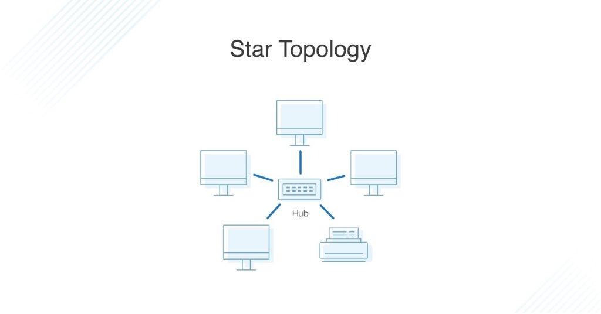
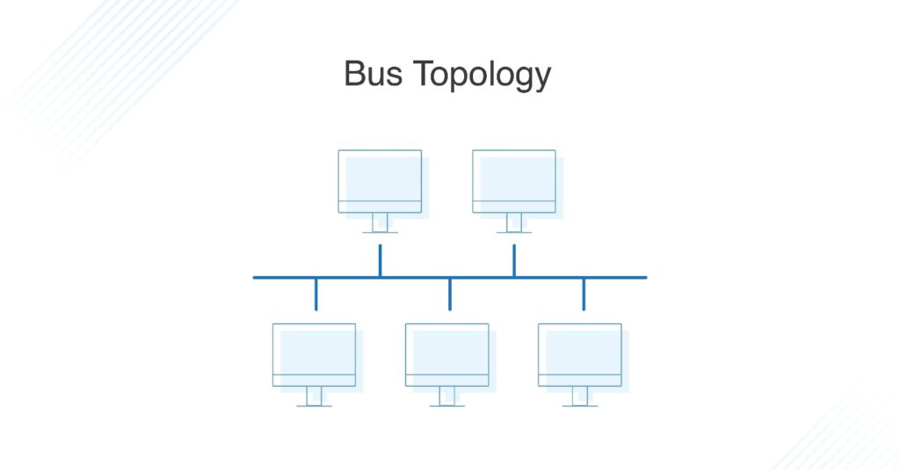
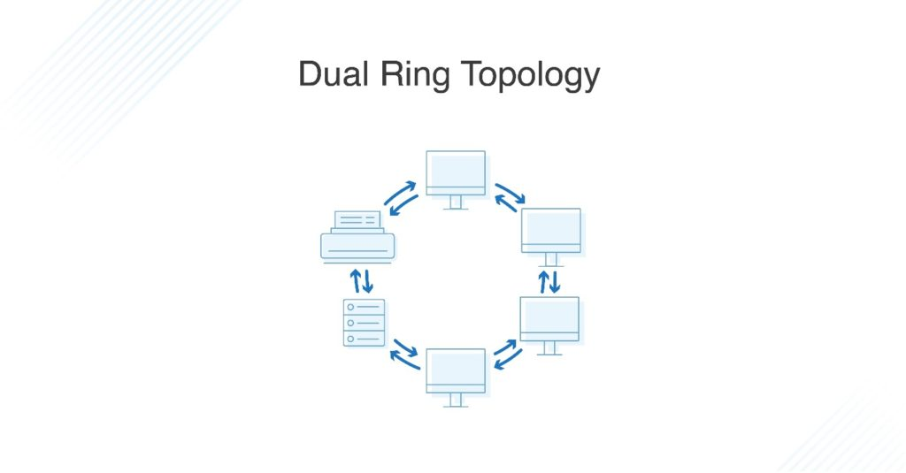
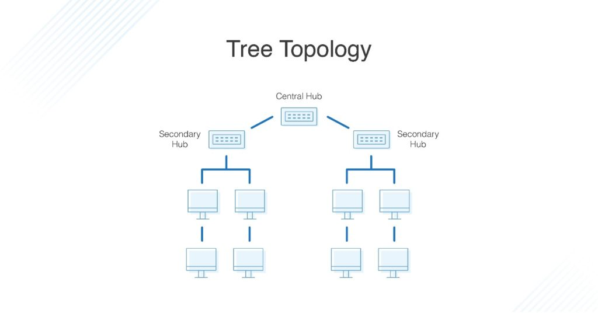
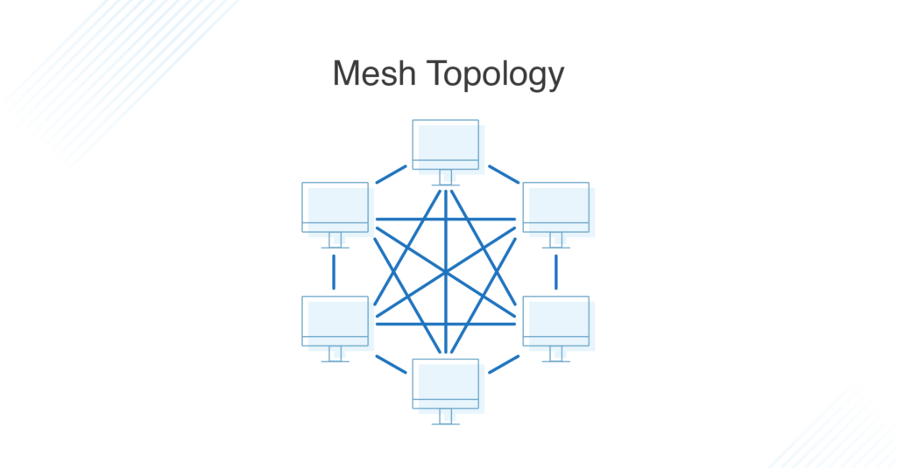
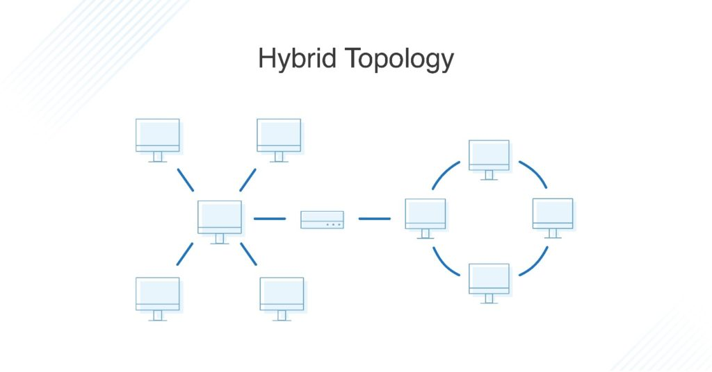

# Network Topology

 

### 네트워크 구성 형태, Network Topology

네트워크 토폴로지는 ***네트워크를 구성하는 물리적, 논리적 구조***를 말합니다다. 다양한 구조가 가능하며, 모든 상황에 항상 좋은 구조는 없습니다. 각각의 특징적인 네트워크 토폴로지는 ***규모, 확장성, 전송 효율, 경제성, 안정성 등에서 서로 다른 특성***을 가지므로 상황에 따라 적절한 구조를 고르는 게 중요합니다.

또한 물리적, 논리적이라는 말에서 확인할 수 있듯이 네트워크 토폴로지는 단순히 이론적인 것이 아닙니다. 케이블 같은 전송 매체를 설치하고, 확장하는 등의 실제 작업을 고려해야 하고, 보다 고차원적으로 데이터가 네트워크 상에서 어떻게 오고가며, 어느 단계에서 에러를 확인할 수 있을 지에 대한 실무적인 고민도 함께 있어야 합니다.

> * 노드, node : 네트워크에 연결된 장치
> * 링크, link : 네트워크에서 장치와 장치 사이의 연결

  

### 성형, Star Topology

성형은 가장 일반적인 네트워크 구성 형태로서 전화망에서 유래했습니다. 네트워크 상의 ***모든 노드가 중앙 허브에 연결되기*** 때문에 허브는 노드 수보다 많은 입출력 포트를, 각 노드는 단 하나의 입출력 포트만 있으면 된다. 허브가 네트워크 상의 모든 트래픽을 수용해 포워딩 해주기 때문에 ***중앙 허브의 성능이 네트워크 전체 성능에 굉장히 중요합니다.***

***설치 방식이 단순하기*** 때문에 재사용성이나 확장성이 우수한 편이지만, 중앙 허브의 위치가 물리적으로 한 장소에 고정되기 때문에 케이블 비용은 많이 드는 편입니다. 홈 네트워크나 작은 사무실처럼 소규모 네트워크에서 사용하기 좋은 형태입니다.

가장 치명적인 단점은 중앙 허브가 모든 네트워크 기능을 담당하기 때문에 중앙 허브에 문제가 생기면 ***전체 네트워크 장애***로 이어진다는 점입니다. 대신 각 링크에서 발생하는 장애는 독립적이기 때문에 전체 네트워크에 영향을 주지 않는다는 장점도 있습니다.

> 
>
> 중앙 허브에서 모든 노드로 링크가 이어지는 성형 구성. 노드 간의 링크는 존재하지 않습니다.

  

### 버스형, Bus Topology

버스형은 네트워크 상의 모든 노드가 연결되고, 모든 데이터가 흐르는 백본 케이블, backbone cable이 존재하는 구성입니다. 그 구성 때문에 특징적인 두가지 장치가 존재하는데, 하나는 백본 케이블의 양단에서 신호의 반사를 방지하는 터미네이터, terminate와 각 노드가 백본 케이블에 접속하기 위한 탭, tab이 바로 그것입니다. 버스형의 노드들은 네트워크에서 발생하는 모든 데이터를 수신하며, 자신이 수신할 데이터가 아니라면 흘려보내는 식으로 작동합니다.

버스형은 케이블이 적게 필요하기 때문에 ***경제적이고 확장성*** 면에서 훌륭합니다.

하지만 성형이 중앙허브에 의존적이듯, 버스형은 백본 케이블에 의존적입니다. 백본 케이블의 대역폭에 따라 네트워크 성능이 좌우되고, 케이블에서 발생하는 감쇠와 잡음도 단점으로 작용합니다. 만약 이 문제가 심하다면 중계기를 추가해 해결할 수 있습니다.

또다른 큰 단점은 버스형의 통신방식이 ***반이중방식, half duplex***이라는 점입니다. 때문에 트래픽이 많은 네트워크에서는 ***충돌이 자주 발생해 네트워크 성능이 크게 저하될*** 수 있습니다. 또한 백본 케이블이 고장나는 경우에는 네트워크 전체가 마비될 수 있고, 유지보수에 긴 시간이 필요할 수 있습니다.

> 
>
> 가운에 가로 케이블이 백본 케이블 / 각 노드로 나눠지는 분기점이 탭 / 백본케이블의 양단에 터미네이터가 있습니다.

  

### 링형, Ring Topology

링형은 ***각 노드가 양 옆의 노드와 연결되는*** 구성 형태입니다. 링형에 데이터가 올라오면 각 노드는 수신지가 자신인지 확인하고 아니라면 다음의 노드에게 전달합니다. 수신지가 자신이라면 데이터를 수신하고 더이상 전달하지 않습니다.

구조가 단순하고, 유지보수가 수월합니다. 장치를 추가하거나 삭제하는 것도 양옆의 두 개의 링크만 조절하면 된다. 또한 장애 위치도 비교적 쉽게 알수 있기 때문에 복구에 걸리는 시간이 빠른 편입니다.

하지만 링형은 ***노드 중에 하나라도 결함이 생기면 네트워크 전체 장애로*** 이어질 수 있습니다. 이를 극복하기 위해 한방향으로만 전송하는 단순 링형이 아니라, 양방향으로 전송 가능한 ***이중 링형***을 채택할 수 있습니다.

> 
>
> 이중 링형 구조는 양방향으로 전송할 수 있습니다.

  

### 트리형, Tree Topology

성형의 변형으로, 중앙 허브, central hub 하나에 모든 노드가 연결되는 것이 아니라 ***하위 허브, secondary hub*** 여러개를 두어 중앙 허브의 역할을 분담하는 것이 핵심입니다. 또한 트리형은 성형의 변형이기 때문에 여전히 성형에서처럼 각 노드들은 서로 직접 연결되지 않고, 오직 허브들이 링크들을 관리해 네트워크 상에서 일어나는 데이터 전송 전체를 관리합니다.

트리형은 구조적 특징 때문에 허브 간의 우선순위 부여, 어느 허브에 연결되는지에 따른 특징적 특성 부여 등 ***네트워크 계층화***에 적합합니다. 그리고 성형 네트워크에 비해 대규모로의 확장성이 더 뛰어납니다.

하지만, 계층이 복잡해질수록 유지보수가 어려워지고, 비용이 증가한다는 단점이 있습니다. 또한 성형과 마찬가지로 허브 집중 구조이기 때문에 허브의 성능과 장애 발생에 영향을 많이 받을 수 밖에 없습니다.

> 
>
> 트리형은 성형의 변형입니다.

  

### 그물형, Mesh Topology

허브와 같은 중앙 제어 노드가 없이, 모든 노드 간에 직접적인 링크가 존재하는 구성 형태입니다. ***N개의 노드와 N(N-1)/2개의 링크***로 구성됩니다. 모든 노드는 N-1개의 입출력 포트가 필요하고, 노드의 수가 늘어날수록 설치에 필요한 케이블의 양도 기하급수적으로 늘어납니다. 즉, 비용이 대단히 비싸고, 설치나 유지보수할 제원의 양이 많아진다는 단점이 있습니다.

하지만 각 링크가 개별적으로 이루어져 수신지나 송신지 외 노드에 데이터가 유실되지 않기 때문에 ***보안성이 우수하고,*** 일부의 장애로 전체 네트워크에 문제가 생기지 않는다는 점, 일부 링크가 유실되어도 우회 가능하다는 점 등 ***안정성에 장점이 많아*** 비용이 높더라도 안정성이 우선시되는 ***중요한 시스템들에 적용되는 형태입니다.***

> 
>
> 그물형에서 모든 노드는 각 노드에 직접 링크됩니다.

  

### 혼합형, Hybrid Topology

네트워크의 규모가 커질수록 위와 같은 순수한 형태의 네트워크는 보기 어렵습니다. 토폴로지 각각의 장단점이 명확하고, 네트워크의 서브넷, subnet들의 상황이 서로 다르기 때문입니다. 이럴 때 효율을 높이고 결함 허용 능력을 증대시키기 위해 여러 토폴로지를 혼합하여 네트워크를 구성합니다.

> 
>
> 이 혼합형은 성형과 링형이 중앙 제어장치를 통해 연결된 형태입니다.

  

> 출처 목록
>
> * [DNSstuff - What Is Network Topology? Best Guide to Types and Diagrams](https://www.dnsstuff.com/what-is-network-topology)
> * 네트워크 개론 3판 / 한빛아카데미

  

Fin.
