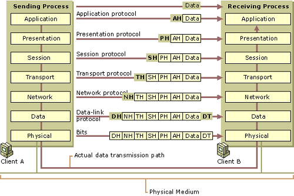

# OSI 7 Layer Reference Model (OSI 7 계층) 을 설명해보아라

> OSI는 Open System Interconnection의 약자입니다.

 

>  네트워크 통신이 발생할 때마다 데이터는 OSI 7계층을 통과해 지나간다. (이미지 출처 : https://www.podo-dev.com/blogs/84)

 

복잡한 과정의 양방향 네트워크 통신에 대한 규정(프로토콜)을 기능별로 구분되는 독립적인 7개 계층으로 나누어 설명한 것입니다. 모든 네트워크에 적용되며, 국제 표준 기구 ISO가 만들었습니다.

 

데이터는 항상 송신부와 수신부의 7계층을 모두 지나 전달됩니다. 송신 프로그램의 상위에서 하위 계층으로, 수신 프로그램의 하위에서 상위 계층으로 이동하며, 각 계층을 지날 때마다 데이터가 조금씩 수정됩니다.

 

**데이터** = 송신하고자 하는 데이터 원본

**응용계층** = 위 데이터에 어떤 프로그램(프로토콜)을 써서 송신하는지 추가*

**표현계층** = 위 데이터에 데이터를 어떻게 암호화(표현)했는지 추가*

**세션계층** = 위 데이터에 데이터를 어떻게 통신을 주고받을 건지 추가* (단방향, 양방향, 반이중, 전이중 등)

**전송계층** = 위 데이터를 어떤 프로그램에서 수신할지 추가*

**네트워크계층** = 위 데이터를 어디로 송신할지 프로그램의 주소를 추가*

**데이터링크계층** = 위 데이터를 안정적으로 송신할 기술적 요소를 추가*

**물리계층** = 위 데이터를 어떤 아날로그 방식으로 전달할지 결정

(* 송신부에서 계층이 내려갈수록 데이터에 추가되고, 수신부에서 계층이 올라갈수록 데이터에서 제거됨)

  

> 출처 목록
>
> * [**podo - ** OSI 7 계층](https://www.podo-dev.com/blogs/84)
> * 네트워크 개론 3판 (한빛아카데미)

  

Fin.
