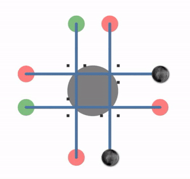

# 교착 상태(Deadlock)의 4가지 조건에 대해 알고있나요?

 

>하나의 자원을( 가운데 회색 원 ) 공통으로 사용하는 네 개의 프로세스( 파란색 실선 )가 교착 상태를 이루는 모습. 마지막에 별도의 프로그램이 순환 대기 상태를 해결해 교착 상태가 종료된다. (출처 : https://en.wikipedia.org/wiki/Deadlock)

 

교착 상태는 두 개 이상의 작업이 서로가 끝나기를 기다리는 체로 무한히 대기하는 상황을 가르킵니다. 교착 상태는 코프만 조건이라고 불리는 아래 4가지 조건을 모두 충족하는 경우에 발생할 수 있습니다.

 

1. **상호 배제 (Mutual exclusion)**

    특정 자원을 한 프로세스에서 사용중인 경우, 다른 프로세스는 해당 자원을 사용할 수 없어야 합니다.

2. **점유 대기 (Hold and wait or resource holding)**

    다른 프로세스에서 사용하는 자원을 사용하기 위해 대기중인 프로세스가 하나 이상의 자원을 사용(점유)하고 있어야 합니다.

3. **비선점 (No preemption)**

    특정 자원을 한 프로세스에서 사용중인 경우, 다른 프로세스가 해당 자원을 강제로 뺏을 수 없어야 합니다.

4. **순환 대기 (Circular wait)**

    교착 상태의 각 프로세스는 순환적으로 이전의 프로세스가 요구하는 자원을 점유한 체, 다음의 프로세스가 사용중인 자원을 사용하기 위해 대기하고 있어야 합니다.

 

> 출처 목록
>
> * https://en.wikipedia.org/wiki/Deadlock
> * [코딩팩토리 - [OS] 교착상태란 무엇인가?](https://coding-factory.tistory.com/311)

  

Fin.