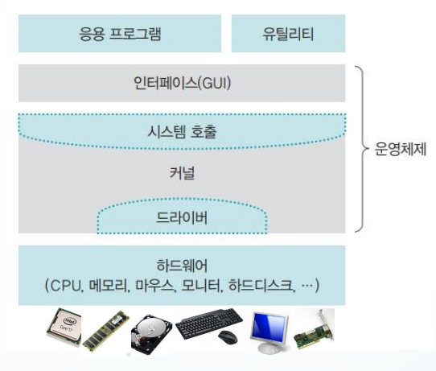

# 커널(Kernel)과 커널 내부의 시스템 콜(System Call)이 무엇인지 설명해보아라

 

 

## 커널이란?

커널(kernel)은 비유하자면 자동차의 엔진과 같은 것입니다.

엔진이 자동차에서 가장 핵심적인 역할을 하며 자동차 성능을 좌우하듯, 커널은 운영체제의 핵심 역할을 담당하고, 운영체제의 성능을 좌우합니다.

운영체제를 크게 두 부분으로 나누면, 운영체제의 핵심기능을 모아놓은 커널과 응용프로그램과 커널 사이에 위치한 인터페이스(Interface)입니다. 실제로 이 두 부분은 나뉘어질 수 있고, 같은 커널에 서로 다른 인터페이스를 결합할 수 있습니다.

  

## 커널의 역할

운영체제의 핵심적인 역할을 모두 한다고 보면 됩니다.

* 프로세스 관리
* 메모리 관리
* 파일 시스템 관리
* 입출력 관리
* 프로세스 간 통신 관리 등

  

## 커널의 구분

각 기능들은 독립적이지 않고 상호의존적이며 유기적입니다. 이 기능들을 어떤 구조로 구현했는지에 따라 커널을 구분합니다.

* 가장 초창기의 커널이자 모든 기능이 하나의 모듈에서 이뤄지는 `단일형 구조 커널`
* 각 기능 별 모듈을 묶어 계층의 개념으로 구분한 `계층형 구조 커널`
  대표적 예: MS의 Windows
* 많은 기능을 사용자 영역에 구현하고, 가장 기본적인 기능만 구현한 `마이크로 구조 커널`
  대표적 예: Apple의 OS X와 iOS

  

## 시스템콜이란?

시스템콜(SystemCall)은 커널이 갖고 있는 유일한 인터페이스입니다.

따라서 커널이 제공하는 기능을 사용하기 위해서 사용자와 응용프로그램은 무조건 시스템콜을 거쳐야 합니다.

커널의 역할이 워낙 중요하고 Low Level에서 이뤄지기 때문에 오류가 발생하면 그 영향이 커지기 쉽습니다. 그렇기 때문에 커널은 시스템콜을 유일한 인터페이스로 두어 사용자나 응용프로그램의 컴퓨터 자원 접근을 차단해 시스템 자원이나 하드웨어 자원을 보호합니다.

  

> 출처 목록
>
> * 출처 : 쉽게 배우는 운영체제 (한빛아카데미)

  

Fin.