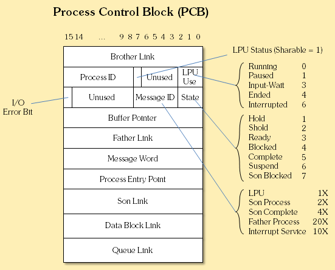

# 컴퓨터 시스템의 구조에서 운영체제란 무엇이고 그 역할에 대해 설명해보아라.

 

>프로세스 제어 블록에는 운영체제가 프로세스를 제어하기 위해 필요한 데이터가 저장됩니다. (이미지 출처 : https://oowgnoj.dev/post/os-process)

 

프로세스란 **디스크에 저장되어 있는 프로그램이 메모리에서 실행되어 동적인 상태가 된 것입니다.** 프로세스의 생성 과정은 다음과 같습니다.
1. 운영체제에 의해 해당 프로세스가 메모리에 올라갑니다.
2. 프로세스에 프로세스 제어 블록이 할당됩니다. (이 두 과정은 거의 동시에 일어납니다.)

 

그렇다면 **프로세스 제어 블록(PCB)이란 무엇일까요?** 프로세스 제어 블록에는 프로세스를 제어하는 데 필요한 다양한 정보들을 포함하는 자료구조입니다.

프로세스 제어 블록에는 프로세스를 특정해주는 PID 값이나 프로세스가 저장된 메모리 위치 정보가 포함됩니다. 또한, 프로세스가 생성되면 완료될때까지 줄곧 실행되는 것이 아니기 때문에, 이러한 상태를 표시하기 위한 상태값(생성 외에도 준비, 실행, 대기, 보류 등이 있음), 대기와 실행에서의 우선순위, 대기 후에 다시 실행될 때 로드되는 각종 레지스터 정보 등이 포함됩니다.

  

> 출처 목록
>
> * [**oowgnoj** - 프로세스 - 운영체제가 실행중인 프로그램을 관리하는 방법](https://oowgnoj.dev/post/os-process)
> * 쉽게 배우는 운영체제 / 한빛아카데미

  

Fin.