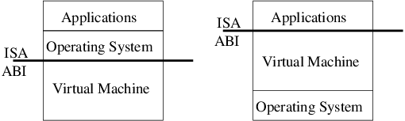

# Virtual Machine

 

>
>
>시스템 가상머신(왼쪽)과 프로세스 가상머신(오른쪽) (이미지 출처 : https://www.researchgate.net/figure/System-VMs-left-and-Process-VMs-right_fig2_221367180)

 

### 가상머신

가상머신은 말 그대로 ***컴퓨터 속에 독립적으로 존재하는 가상의 컴퓨터***를 의미합니다. ***컴퓨터 속에 존재한다***는 말은 실제 컴퓨터와 달리 하드웨어와 직접 통신하지 않으며, 일반적으로 소프트웨어로 가상 구성된 하드웨어와 통신하며 작동한다는 의미입니다. ***독립적으로 존재한다***는 의미는 그 자체로 완전한 컴퓨터의 역할이 가능하며, 실제 컴퓨터의 소프트웨어가 그렇듯 가상머신 안의 소프트웨어는 가상머신이 제공하는 자원과 환경을 벗어날 수 없다는 점입니다.

가상머신은 두가지로 나뉘는데, 시스템 가상머신과 프로세스 가상머신입니다. 이중 본 문제에서 물어보는 운영체제와 응용프로그램 사이의 가상머신은 **프로세스 가상머신** 입니다.

  

### 프로세스 가상머신 (문제의 답)

프로세스 가상머신은 프로세스의 생성주기 동안 실행되는 가상머신입니다. 보통의 경우 ***소프트웨어(프로세스)의 플랫폼 호환성***을 개선하기 위해 존재합니다. ***예를 들어 JVM(Java virtual machine)은*** 운영체제와 상관없이 동일한 코드로 작동된다는 JAVA의 철학 "write once run anywhere"을 반영하는 존재입니다. 만약 JVM이 없다면 유닉스에서 작성한 JAVA 코드는 유닉스와 커널이 다른 윈도우에서는 작동이 불가합니다. 즉 프로그램이 사용되는 운영체제 마다 매번 코드를 다시 작성해야 하는 것입니다.

  

### 그렇다면 파이썬도 가상머신을 갖고 있나?

맞습니다. 파이썬도 맥에서 작성한 코드를 윈도우에서 실행하는 것, 즉 플랫폼 호환성을 지원하지 않을까요? JAVA와 마찬가지로 Python도 가상머신이 존재합니다. 하지만 왜 JVM 만큼 많이 드러나지 않을까요? 대신 왜 Interpreter가 더 중요하게 여겨질까요? (참고로 JAVA도 Interpreter가 존재합니다. JAVA Compiler가 만든 Bytecode를 JVM이 실행할 때 Interpreter가 Bytecode를 해석합니다.) 이것은 JAVA와 Python의 동작 방식이 다르기 때문입니다. 먼저 JAVA는 정적 데이터 타입을 지원하지만 Python은 동적 데이터 타입을 지원합니다. 여기서 더 나아가 Python은 특정 데이터를 저장하는 비트나 바이트에 대응될만한 데이터 타입이 사실 없습니다. 모든 데이터 타입이 그 데이터 타입의 객체를 말하기 때문입니다. 그만큼 실제코드와 Bytecode의 유사성이 떨어집니다. 그렇기 때문에 Interpreter의 역할이 JAVA에서보다 Python에서 훨씬 복잡하고 중요합니다. 반면에 JAVA는 JVM을 통해 Bytecode를 기계어로 해석합니다. 하드웨어와 통신하기 때문에 하드웨어와의 인터페이스를 제공하는 플랫폼(운영체제)와의 호환성이 굉장히 중요한 문제라는 이야기입니다. 이런 이유 때문에 두 언어 모두 가상머신과 Interpreter를 갖고 있음에도 불구하고, 각 언어에서 중요하게 생각되는 부분이 서로 다른 것입니다. 출처의 stackoverflow에서 인용한 말로 이 문단을 마무리하겠습니다. 종합해서 말하자면, ***iPhone에서 실행되는 Python 프로그램***은 iPhone의 qemu 가상머신에서 실행되는 LLVM으로 만들어진 JAVA Interpreter/JVM에서 실행되는 JAVA로 만들어진 Python Interpreter/VM으로 실행되는 Python으로 만들어진 것입니다.

  

### 시스템 가상머신

***시스템 가상머신***은 간단히 설명하면, 한 운영체제 내에 독립된 운영체제를 설치하는 경우를 생각할 수 있습니다. 맥 컴퓨터에 윈도우를 설치하는 경우에도 가상머신을 사용할 수 있고, 클라우드 서버에서 사용자에게 컴퓨터 자원을 분배할 때 사용하기도 하고, 악성코드를 분석할 때 전체 컴퓨터의 감염을 막기 위해 가상머신을 사용하기도 합니다.

  

> 출처 목록
>
> * [위키백과 - '가상 머신'](https://ko.wikipedia.org/w/index.php?title=%EA%B0%80%EC%83%81_%EB%A8%B8%EC%8B%A0&action=edit&section=3)
> * [나무위키 - '가상머신'](https://namu.wiki/w/%EA%B0%80%EC%83%81%EB%A8%B8%EC%8B%A0#rfn-15)
> * [stackoverflow - Java “Virtual Machine” vs. Python “Interpreter” parlance?](https://stackoverflow.com/questions/441824/java-virtual-machine-vs-python-interpreter-parlance)
> * [Introduction to Programming Using Java - What is the difference between a "compiler" and an "interpreter"?](http://math.hws.edu/eck/cs124/javanotes3/c1/quiz-answers.html#:~:text=(Java%20uses%20a%20compiler%20to,then%20executed%20by%20an%20interpreter.))
> * [JVM | What is Java Virtual Machine & its Architecture](https://www.guru99.com/java-virtual-machine-jvm.html#:~:text=Java%20Virtual%20Machine%20(JVM)%20is,code%20for%20a%20particular%20system.)
> * 쉽게 배우는 운영체제 / 한빛아카데미

  

Fin.