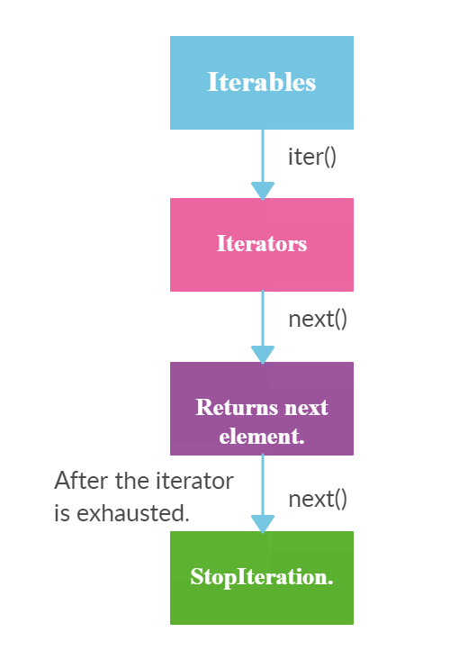

# len(range(5))과 len(iter(range(5))의 실행결과를 설명하고, iterator에 대해 설명해보아라

<br>



> Python의 `<iterator>` 객체는 `__iter()__`, `__next()__` 로 데이터를 하나씩만 조회할 수 있는 특별한 객체입니다.

<br>

두 실행결과는 다음과 같습니다.

```python
print(len(range(5)))
# 5
print(len(iter(range(5))))
# TypeError: object of type 'range_iterator' has no len()
```

<br>`print(len(iter(range(5))))` 에서 **`TypeError` 가 발생하는 이유는 `iter()` 함수가 `<iterator>` 객체를 반환하기 때문입니다.** `<iterator>` 객체는 모든 데이터를 저장하지 않고, `__iter__()`와 `__next__()`로 한 순간에 하나의 데이터만 리턴하는 데이터 타입입니다. 때문에 **list나 set, string 같은 다른 iterable한 데이터 타입과는 달리 `len()` 함수나 인덱싱 혹은 슬라이싱이 불가능합니다.** (`__next__()`는 데이터의 끝에 도달해`StopIteration Exception`가 발생되기 전까지 가능합니다.)

<br>
`<iteraor>` 객체의 특징은 다음과 같습니다.

- `<iterator>`도 list나 tuple처럼 iterable한 데이터입니다.
- 다만 위에서 말했듯 데이터를 모두 저장하고 있지 않기 때문에 len()와 같은 일부 기능의 사용에 제한이 있습니다.
- **대신 데이터 사용량이 적기 때문에 for문이나 zip(), map() 등에서 `<iterator>`를 사용하면 다른 iterable 데이터와 같은 효과를 내면서 메모리 효율적인 코드를 구현할 수 있습니다.**
- 만약 `<iterator>`에 `len()` 함수를 쓰고 싶다면 `list(<iterator>)` 등으로 타입 변환 후 사용해야 합니다.

<br><br>

> 출처 목록
>
> * [**Analytics Vidhya - **Iterable vs Iterator in Python](https://medium.com/analytics-vidhya/iterable-vs-iterator-in-python-eda1295a815e)

<br><br>

Fin.