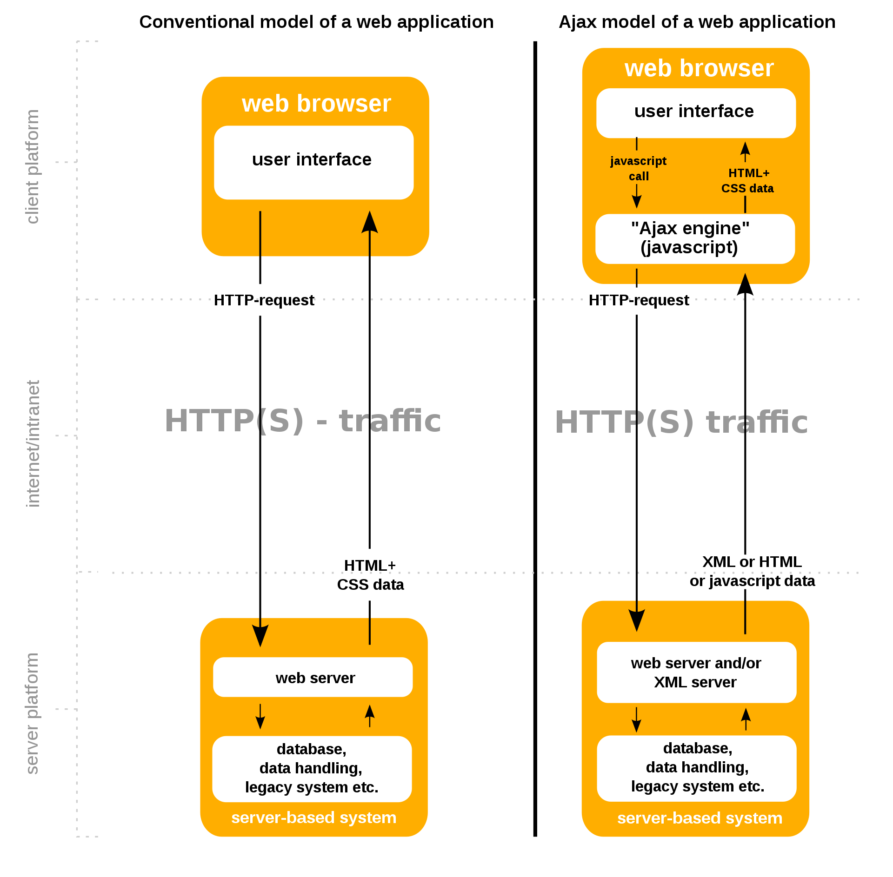

# AJAX

 

> 서버에서 처리되던 데이터 처리의 일부가 AJAX를 이용한 브라우저로 넘어왔다. (이미지 출처 : https://ko.wikipedia.org/wiki/Ajax)

 

AJAX는 비동기적 JavaScript와 XML입니다. 기술적인 패러다임을 설명하는 용어인데, 클라이언트의 웹페이지 내용 중 일부만 새로고침 하는 경우에 사용하는 기술입니다. 예를 들어 "인피니티 스크롤"은 스크롤이 화면 최하단까지 내려오는 것을 이벤트로 감지하여 AJAX로 추가 데이터를 불러오고, 불러온 데이터를 DOM에 추가하는 식으로 구현됩니다.

 

용어가 생겨난 시점과 달리 현재에는 데이터를 주고받는 데이터 형식으로 XML보다 JSON을 주로 사용하고 있다는 점이 재밌습니다. ~~(지금 생긴다면 AJAJ가 됐을까요?)~~

  

* https://ko.wikipedia.org/wiki/Ajax

  

Fin.

