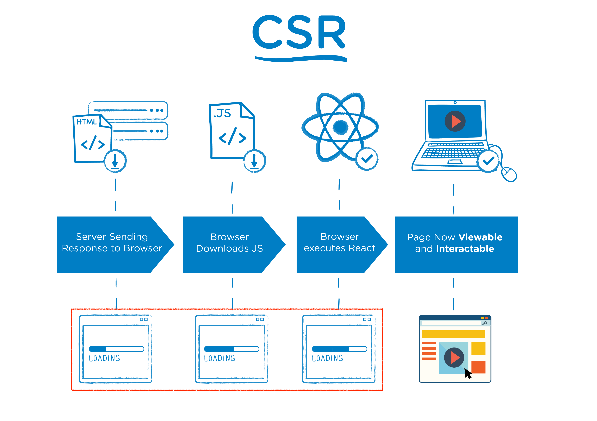

# CSR vs SSR

 

> CSR과 SSR은 사용자에게 언제 보여지는지(viewable) 언제 동작하는지(interactable)에서 차이가 생긴다. (이미지 출처 : https://d2.naver.com/helloworld/7804182)

 

CSR 은 Client Side Rendering 이고, SSR 은 Server Side Rendering 입니다.
둘은 사용자에게 보여지는 **웹 페이지의 렌더링을 하는 주체가 client 인지 server 인지로 구분됩니다.**

 

먼저, 전통적인 방식은 SSR 입니다.
SSR 에서 server 는 화면에 보여질 모든 것을 준비해 client 로 전달했습니다.
이때 client 는 단순히 화면에 받은 문서를 표시할 뿐이었습니다.

 

CSR은 스마트폰 사용이 늘어남에 따라 점차 주류가 되었는데,
SPA (Single Page Application) 웹이 많아진 것이 그 이유입니다.

 

모바일에서 SPA 사용이 많아진 이유는 여러가지가 있습니다.
첫째로 매번 전체 페이지를 새로고침 하기에는 컴퓨팅 파워가 부족했고,
지금은 많이 개선되었지만 초기에는 무선 인터넷 대역폭 역시 매우 제한적 이었습니다.

 

결과적으로 최초에는 문서 한장만 받아오고, 이후에는 일부 데이터만 받아와 갈음하는
**SPA 와 CSR 조합이 대세로 자리 잡았습니다.**
CSR 을 통해 원래 server 가 하던 일을 client 가 덜어왔기 때문에,
server 는 같은 자원으로 더 많은 요청에 대응할 수 있게 되었습니다.
또한 모바일 유저들의 웹 사용자 경험이 크게 개선되었습니다.

 

반대로 SSR 도 여전히 웹의 큰 부분을 차지합니다.
client 를 위한 코드 작업이 필요 없기 때문에 노동력이 비교적 적게 들고,
정보들이 독립된 페이지로 존재하기 때문에 SEO (Search Engine Optimization) 면에서 더 좋기 때문입니다.

  

> 출처 목록
>
> * [NAVER D2 - 어서 와, SSR은 처음이지?](https://d2.naver.com/helloworld/7804182)

  

Fin.

