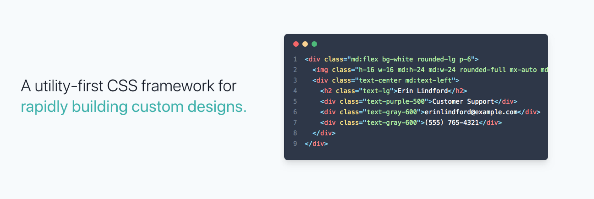

# Functional CSS

 

> 함수형 CSS를 사용하는 웹 프레임워크인 Tailwind CSS의 HTML 코드 예시

 

Functional CSS는 Functional Programming과 비슷합니다. 함수형 프로그래밍이 단일의 기능을 하는 순수한 함수를 지향하듯, 함수형 CSS는 하나의 형태를 표현하는 순수한 클래스 단위 스타일링를 지향합니다.

 

예를 들어 네비게이션 바를 스타일링할 때, Semantic CSS에서는 .navbar 클래스에 대한 스타일링을 지정할 것입니다. 하지만 함수형 CSS에서는 .text-align-center, .text-bold 등 여러 클래스를 부여함으로서 스타일링을 완성합니다.

 

함수형 CSS는 HTML 문서 작업만으로 스타일링을 완성할 수 있기 때문에 개발자의 생산성을 높여주고, 사용하는 HTML 문서의 수량과 상관없이 일정한 규모의 CSS를 사용한다는 점에서 효율적입니다. 이러한 장점 때문에 Bootstrap나 Tailwind CSS 등 많은 유명 웹 프레임워크에서 함수형 CSS를 사용하고 있습니다.

 

다만, 함수형 CSS는 개발자의 CSS 개발 능력을 저하시킬 수 있고, 여러 스타일이 적용될 경우 HTML 문서가 복잡해지는 단점이 있습니다. 그리고 함수형 CSS가 적합하지 않은 상황이 있는데, 예를 들어 아이템 목록을 그리드나 리스트 형태 등 사용자가 선택적으로 출력 형식을 결정하는 페이지에서는 함수형 CSS을 사용하기 어렵습니다.

  

> 출처 목록
>
> * [https://www.browserlondon.com/blog/2019/06/10/functional-css-perils/

  

Fin.