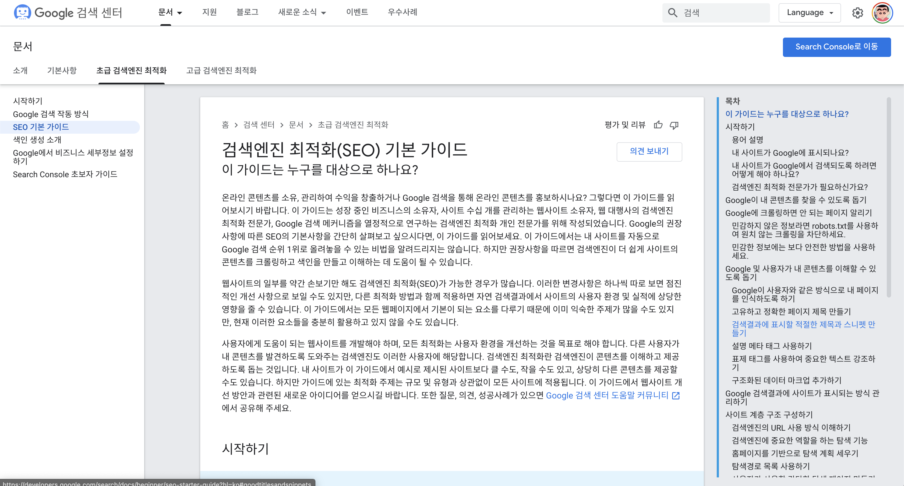

# SEO

 

> 구글의 SEO 가이드를 안내하는 웹페이지 (출처 : https://developers.google.com/search/docs/beginner/seo-starter-guide?hl=ko)

 

**검색 엔진 최적화는(SEO, Search Engine Optimization) 비교적 최근에 생긴 용어로 구글이나 네이버 등 수많은 사용자가 사용하는 검색 엔진에 자신의 콘텐츠나 웹 사이트가 잘 검색되도록 하는 작업을 의미합니다.** 전세계적으로 수많은 사용자가 사용하는 검색 엔진에서 검색 결과 상단에 노출되면 마케팅 측면에서 대단한 이득이기 때문입니다.

 

그 방법은 **검색 엔진의 작동 방식에 따라 다를 수 있지만,** 일반적인 경우 콘텐츠 내부에 검색에 사용될 만한 키워드를 언급하는 것에서부터 시작할 수 있겠습니다. 그리고 구글의 경우는 웹 사이트에 대해 평가할 때 다른 웹 사이트에서 인용한 횟수를 사용하기 때문에 이를 이용해야 좋겠고, 네이버의 경우에는 자사 플랫폼을 사용하는 사이트를 우선 노출하기 때문에 이를 활용해야겠습니다.

 

이밖에도 데스크톱이나 모바일 환경에서 모두 잘 작동하는가, 로딩 시간이 얼마나 걸리는가 등에 대한 평가도 SEO에 적용될 수 있습니다.

  

* [Google - 검색엔진 최적화(SEO) 기본 가이드](https://developers.google.com/search/docs/beginner/seo-starter-guide?hl=ko)
* [Microsoft - 소기업을 위한 SEO: 알아두어야 할 모든 것](https://www.microsoft.com/ko-kr/microsoft-365/business-insights-ideas/resources/seo-for-small-businesses-everything-you-need-to-know)
* [BLOTER - 검색엔진 최적화, SEO를 알아봅시다](https://www.bloter.net/newsView/blt201805130001)
* [위키백과](https://ko.wikipedia.org/wiki/%EA%B2%80%EC%83%89_%EC%97%94%EC%A7%84_%EC%B5%9C%EC%A0%81%ED%99%94)

  

Fin.

