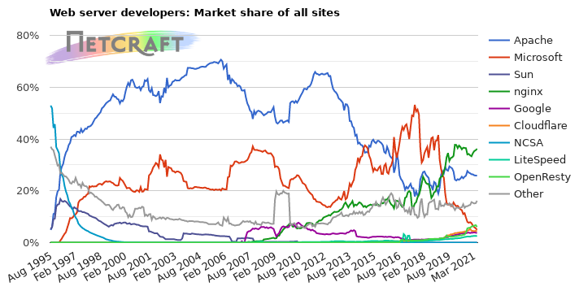

# Web Server

 

> 인터넷에서 사용되는 웹서버의 비율을 나타내는 그래프이다. 20년대에 들어 Nginx의 점유율이 Apache를 앞질렀으며, 현재 약 10%p 차이를 보인다. (이미지 출처 : https://news.netcraft.com/archives/category/web-server-survey/)

 

웹 서버는 HTTP 프로토콜로 들어오는 요청에 대한 응답을 제공하는 소프트웨어와 하드웨어를 통칭합니다.

 

웹 서버 중 웹 상에서 가장 큰 비중을 차지하는 양대산맥으로 Apache와 Nginx가 있고, 현재는 작동하지 않는 웹 사이트까지 포함했을 때 가장 큰 비중을 차지하는 MS의 IIS가 있습니다.

 

먼저 Apache와 Nginx는 오픈소스이지만, IIS는 MS가 제공하는 유료 소프트웨어입니다. 따라서 IIS는 윈도우에서만 사용 가능하고, 우수한 성능과 더불어 GUI를 제공해 진입장벽이 낮다는 장점이 있다고 합니다.

 

Apache는 1990년대에 등장해 현재까지 가장 많이 사용되는 웹 서버인데, 프로세스와 스레드 기반으로 작동합니다. 하나의 요청에 프로세스나 스레드를 생성해 대응합니다. 모듈이 다양하고, 커뮤니티가 활성화됐다는 장점이 있지만, 반대로 동시에 많은 요청이 발생할 경우 CPU 과부하가 생긴다는 단점이 있습니다.

 

어쩌면 이런 Apache의 단점을 극복하기 위해 2000년대에 등장한 웹 서버가 Nginx입니다. Nginx는 비동기적인 이벤트 처리 기반의 웹 서버입니다. 비동기적 처리가 가능하기 때문에 요청이 많아져도 과부하 없이 비교적 빠르게 응답하고, 같은 컴퓨팅 파워 대비 성능이 좋기 때문에 최근 사용량이 늘고 있습니다. 위 그래프를 보면 2020년대에 들어 Apache의 점유율을 넘어선 것을 확인할 수 있습니다.

 

참고로 Django를 통한 배포를 진행할 때는 Nginx가 주로 사용되어 인터넷에서 자료를 더 쉽게 찾아볼 수 있습니다.

  

Fin.

