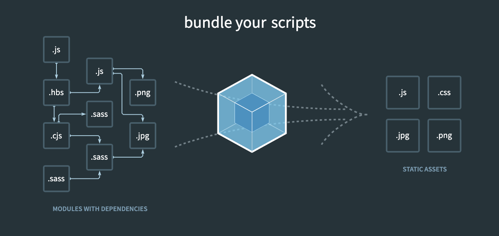

# Webpack이란 무엇인지 설명하고, Vue 프로젝트에서는 Webpack 설정을 어떻게 하는 지 설명하시오.

<br>



> Webpack 개념도 (이미지 출처 : https://webpack.js.org/)

먼저, Webpack에 대해 설명하기 위해서는 JavaScript 모듈에 대해 알아야 합니다.

<br>

JavaScript에서 **모듈이란 하나의 스크립트 파일**을 의미합니다. 웹 애플리케이션의 규모가 커지면서 **유지보수나 재사용성**을 높이기 위해 모듈의 개념이 도입되었습니다. 쉽게 말해 자주 사용하는 기능은 별도 파일(모듈)로 작성해 어디서든 해당 모듈을 불러오기만 하면 코드의 중복 없이 해당 기능을 사용할 수 있게 하는 것입니다. 모듈 초기에는 JavaScript의 모듈을 관리하기 위한 모듈 시스템으로 AMD, UMD, CommonJS 등이 있었는데, 최근에는 **웹 환경의 ES6 module, Node.js 환경의 CommonJS로 통일**되고 있습니다.

<br>

Vue 프로젝트를 진행하면서 같은 .js 파일임에도 모듈을 입출력하는 코드에 차이가 있었습니다. 처음에는 눈치채지 못했지만, 이 코드의 차이가 웹 환경에서와 Node.js 환경에서 사용하는 모듈 시스템이 다르기 때문이었습니다. 둘의 코드는 아래와 같습니다.

<br>

```JavaScript
// export CommonJS module in Node.js
module.exports = {
  // codes..
}

// import CommonJS module in Node.js
const moduleImport = require('./a.js')
```

```javascript
// export ES6 module in Web
const A = {}
export default A

// import ES6 module in Web
import A from 'moduleImport'
import { A, B } from 'moduleImport'
import * from 'moduleImport'
```

<br>

모듈의 개념에는 모듈 시스템이 통합되었음에도 해결되지 않는 문제가 있었습니다. 모듈의 로딩 순서에 따라 종속적인 모듈이 제대로 작동하지 않거나, 전역 변수의 충돌 문제 등 **의존성 문제**가 바로 그 문제점입니다. 애플리케이션이 크고 복잡해질수록 의존성 문제도 따라서 복잡해졌습니다. 이 의존성 문제를 해결하기 위한 도구가 바로 **모듈 번들러**입니다.

<br>

모듈 번들러란 프로젝트에 사용되는 모듈과 리소스들의 구조와 의존성을 분석하고 번들로 묶고 패킹해 관리하는 소프트웨어입니다. **webpack**은 가장 널리 사용되는 대표적인 모듈 번들러로 공식문서의 말을 따르면 ***static module bundler*** 로서 스크립트 파일 뿐 아니라 CSS 파일이나 이미지 파일 등 여러 정적 파일을 관리해줍니다.

<br>

webpack은 애플리케이션을 관리할 때 프로젝트에 필요한 모든 모듈과 정적 파일을 포함하는 **의존성 그래프**를 내부적으로 작성하고, 그 결과로 하나 이상의 번들을 생성합니다.

<br>

Vue-CLI에서 프로젝트를 만들게 되면 webpack에 대한 초기설정이 자동으로 완료되며, 세부 설정을 하기 위해서는 `webpack.config.js` 파일을 수정하면 됩니다. `webpack.config.js`는 `webpack 4.0.0` 이상에서는 선택사항으로 해당 파일이 없어도 webpack이 기능을 수행하는데 문제는 없습니다.

<br><br>

> 출처 목록
>
> * [**Baeharam - **[JS] 모듈에 대한 이해와 사용법](https://baeharam.netlify.app/posts/javascript/module)
> * [**webpack official documentation**](https://webpack.js.org/concepts/)
> * [**mnz.log - ** [Webpack] 웹팩 개념 알아보기](https://velog.io/@mnz/Webpack-%EC%9B%B9%ED%8C%A9-%EA%B0%9C%EB%85%90-%EC%95%8C%EC%95%84%EB%B3%B4%EA%B8%B0)
> * **SSAFY 수업 자료**

